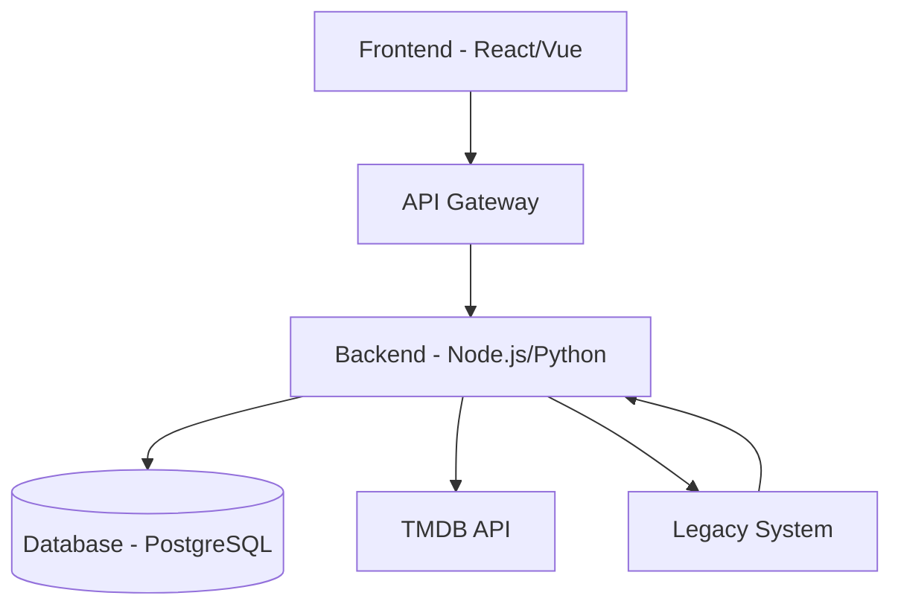

# Arquitectura del Sistema

## Overview
This document describes the system architecture, including component responsibilities and data flow.

## Architecture Diagram

## Component Responsibilities

### Frontend
- User interface and interaction
- Display movie data and search results
- Handle user authentication (if applicable)
- Responsive design for web/mobile

### API Gateway
- Route requests to appropriate services
- Rate limiting and authentication
- Request/response transformation

### Backend
- Business logic implementation
- Data processing and transformation
- Integration with TMDB API
- Database operations (CRUD)
- Legacy system integration

### Database
- Store normalized movie data
- User preferences and session data
- Optimized queries for search and filtering

### TMDB API
- External data source for movie information
- Rate limit management
- Error handling for API failures

### Legacy System
- Existing movie database (if applicable)
- Data migration and synchronization
- Backward compatibility layer

## Data Flow
1. User searches for movies via Frontend
2. Request goes through API Gateway to Backend
3. Backend queries Database first, then TMDB API if needed
4. Data is transformed and normalized
5. Response sent back through the chain
6. Legacy system updated for consistency